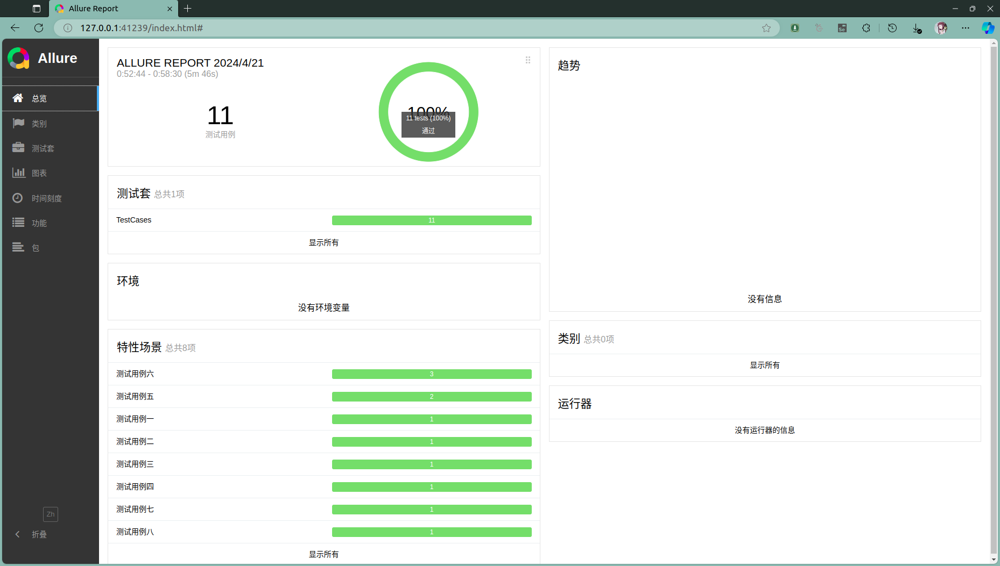

# 家校通管理系统

## 系统概述

### 系统共有三类用户，分别是管理员、老师、学生家长；

#### (1) 老师
* 老师使用系统前需要注册，其注册信息管理员审核通过后才能生效；
* 老师在登陆系统后可以创建新的班级并进行班级信息管理，新创建的班级信息在管理员审核通过后才能生效，班级信息一旦通过审核则不能再修改；
* 老师也可以加入已生效的班级，需班级创建者通过；
* 老师加入班级后可以发布班级通知，班级通知对该班级的所有家长及老师可见，通知发布后不可修改但可以删除；
* 同一班级的老师和家长之间也可以通过站内信息进行沟通；
* 老师可以通过多条件查询对班级通知和站内信息进行查询；

#### (2) 家长
* 家长使用系统前需要进行注册；
* 家长登陆后可以申请加入的班级，申请信息在班级创建者审核通过后生效；
* 家长加入班级后可以查看班级通知；通过站内信息与班级老师沟通；
* 家长可以通过多条件查询对班级通知和站内信息进行查询；

#### (3) 管理员
* 管理员在登陆系统后可以进行教师信息、班级信息进行审核；
* 管理员可以发布系统通知，系统通知对所有用户可见，通知发布后不可修改但可以删除；

## 系统测试
使用allure(2.28.0)库生成测试报告，预览图如下：

## 项目启动
* tomcat版本为9.0.80
* 在[数据库配置文件](./src/main/java/c3p0-config.xml)配置数据库信息
* mysql运行[SQL脚本](hscms.sql)
* 默认有一个管理员账号，邮箱为admin@hscms.com，密码为123456
* 默认有一个老师账号，邮箱为teacher@teacher.com，密码为123456
* 默认有一个家长账号，邮箱为guardian@guardian.com，密码为123456
